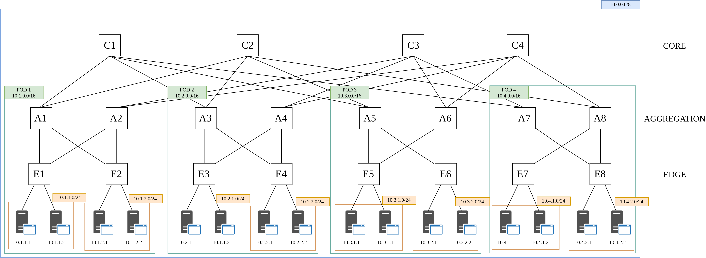
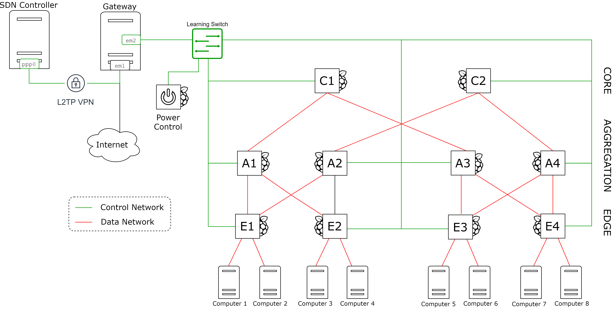
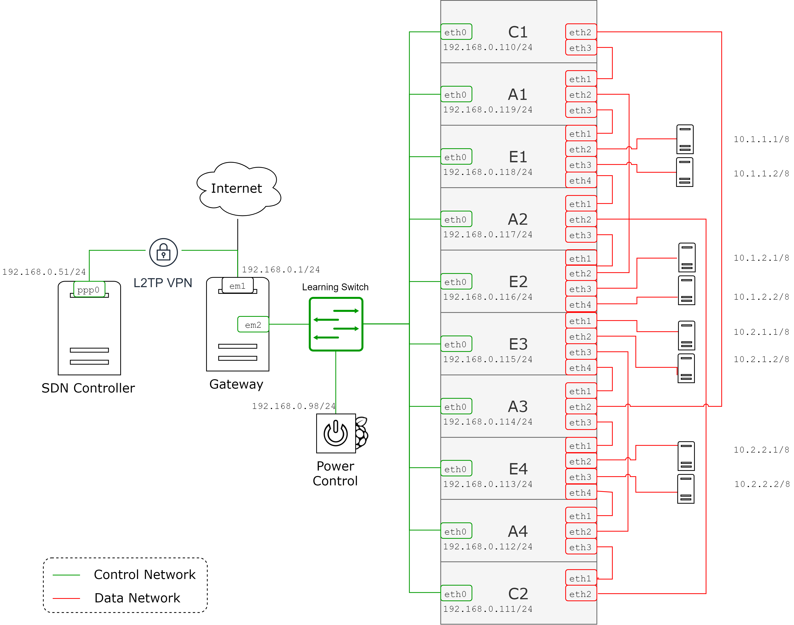

GreenSDN project : Create a plug and play application implementing ElasticTree

# Reporsitory Organisation
### ``` mininet-simulation ``` folder: 
* ``app`` : external application using the API REST of ONOS. This is the logical module of the ElasticTree application.
    *   ```topo_discovery.py``` : build graph of the current topology based on ONOS info
    *   ``` defaultpath.py``` :  create single default path between every host in the network
    *   ``` flowMeasure.py``` : compute the number of switches needed in each layer in order to satisfy traffic and save energy
    *   ``` monitoringTools.py ``` : basic functions
    *   ``` runElasticTree.py ``` : main function (deamon)
    *   ``` deviceList ``` : folder to store the list of devices for 4 and 4 degree fattre
    *   ``` ruleTempalte ```: folder to store json template of flow rules

* ``fattree.py`` : Python file to create virtual  SDN network connected to ONOS controller (fat-tree topology) using mininet. The topology is k-fattree (4 or 8 degree)

### ``` Pi-simulation``` folder:
* ``app`` : external application using the API REST of ONOS. This is the logical module of the ElasticTree application.
    *   ```topo_discovery.py``` : build graph of the current topology based on ONOS info
    *   ``` defaultpath.py``` :  create single default path between every host in the network
    *   ``` flowMeasure.py``` : compute the number of switches needed in each layer in order to satisfy traffic and save energy
    *   ``` monitoringTools.py ``` : basic functions
    *   ``` runElasticTree.py ``` : main function (deamon)
    *   ``` deviceList ``` : folder to store the list of devices for our special fattre
    *   ``` ruleTempalte ```: folder to store json template of flow rules

* ```scriptsSSH_pi ``` : scripts to simplify the management of Raspberry-pi


# Requirements
### ONOS requirements
* git
* zip
* curl
* unzip
* python 2.7
* python 3 (needed by Bazel)
* Bazel (minimum version : 0.27.0)

### ONOS
* Version 2.2
* Developper Quick Start : https://wiki.onosproject.org/display/ONOS/Developer+Quick+Start

### Python ElasticTree app requirements
* pip (package management)
* Python packages :
    *   networkx
    *   matplolib
    *   request
    *   json

Command: ```~$ pip install package```
# Clone the repository

```
~$ git clone https://github.com/disnetlab/GreenSDN.git
```

# Run the appliction

1. Run ONOS controller and check default application

    Run:
    ``` 
    ~$ cd onos
    ~/onos$ bazel run onos-local -- clean debugm
     ```
    Check apps:
    ```
    ~/onos$ ./tools/test/bin/onos localhost
    onosCLI@root > apps -a -s
    *   9 org.onosproject.hostprovider         2.2.0.SNAPSHOT Host Location Provider
    *  16 org.onosproject.optical-model        2.2.0.SNAPSHOT Optical Network Model
    *  38 org.onosproject.drivers              2.2.0.SNAPSHOT Default Drivers
    *  65 org.onosproject.lldpprovider         2.2.0.SNAPSHOT LLDP Link Provider
    *  66 org.onosproject.openflow-base        2.2.0.SNAPSHOT OpenFlow Base Provider
    *  67 org.onosproject.openflow             2.2.0.SNAPSHOT OpenFlow Provider Suite
    *  94 org.onosproject.gui2                 2.2.0.SNAPSHOT ONOS GUI2
    ```
    If the list is not like this one, please add missing app with the following command:
    ```
    app activate <app name>
    ```

2. Run CLI and activate some onos application
    ``` 
    ~/onos$ ./tools/test/bin/onos localhost
    onosCLI@root > app activate proxyarp 
    onosCLI@root > app activate fwd
    ``` 
    (proxyarp : for default path algo, fwd : for the host discovery - will be deactivated later)

<span style="color:red">/!\ WARNING </span> Without ```proxyarp``` default paths are not working
### Mininet simulation


3. Create network (mininet) 4 or 8 degree (```k```) and pingall

    ``` 
    ~$ cd GreenSDN/mininet-simulation/ 
    ~/GreenSDN/mininet-simulation$ sudo python fattree.py <k> <traffic|notraffic>
    mininet > pingall
     ```

     Example (4-fat-tree and no traffic generated) : 
     ```
     ~/GreenSDN/mininet-simulation$ sudo python fattree.py 4 notraffic
     ```

4. Deactivate forwarding ONOS app using ONOS CLI

    ``` 
    onosCLI@root > app deactivate fwd 
    ```

5. Create default path
    ```  
    ~$ cd GreenSDN/mininet-simulation/app/ 
    ~/GreenSDN/mininet-simulation/app$ python defaultpath.py <k>
    ```

6. Run ElasticTree algo
    ```  
    ~$ cd GreenSDN/mininet-simulation/app/
    python runElasticTree.py <k>
    ```
### Pi simulation
3. Pingall from the computer 1
    ```  
    root@compute1~$ ./pingall
    ```

4. Deactivate forwarding ONOS app using ONOS CLI

    ``` 
    onosCLI@root > app deactivate fwd 
    ```

5. Create default path
    ```  
    ~$ cd GreenSDN/pi-simulation/app/ 
    ~/GreenSDN/pi-simulation/app$ python defaultpath.py <k>
    ```

6. Run ElasticTree algo
    ```  
    ~$ cd GreenSDN/pi-simulation/app/
    python runElasticTree.py
    ```

# Network topology

Fat-tree topology

## Network IP adresses
IP networks in a ```k=4``` fat-tree topology.
The idea is the following : to create different sub-network depinding the position in the fat-tree topology. We decided to use ```10.0.0.0/8``` as network address. Then, each POD sub-network is identify throught the 8 following bits. The POD p is using the ```10.p.0.0/16``` network IP address. The next 8 bits are used to specify the number of the edge switch in the current POD, the IP address of this sub-network is : ```10.p.e.0/24```. Finally, the last 8 bits are used by the number of the host connected to the edge switch e: ```10.p.e.h```



## Network default-path
 Flow rules for downward traffic match the IP destination and send the traffic to the corresponding port. Every layer of switches only matches a certain number of bits of the IP address, this number corresponds to the netmask of the following sub-net.
 The upward traffic is defined by: traffic that goes outside of the current sub-network. Here, only the source IP is used to balance the traffic on every links available. Once again, netmasks are used to reduced the number on flow rules.


<span style="color:red">/!\ WARNING </span> Higher priority (high number) matches FIRST

## Network Pi-tower

